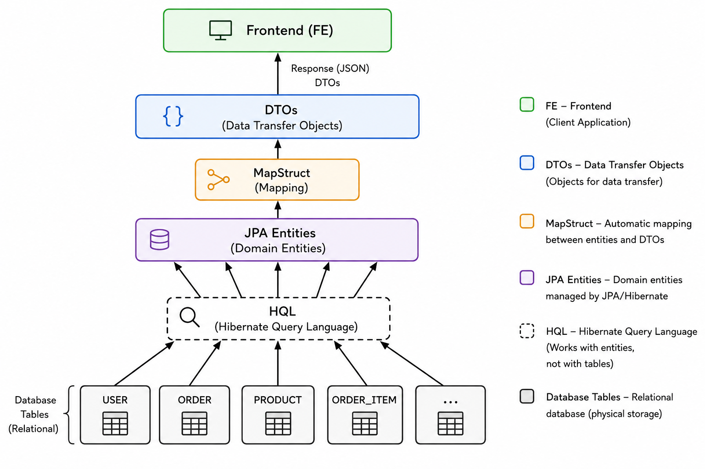
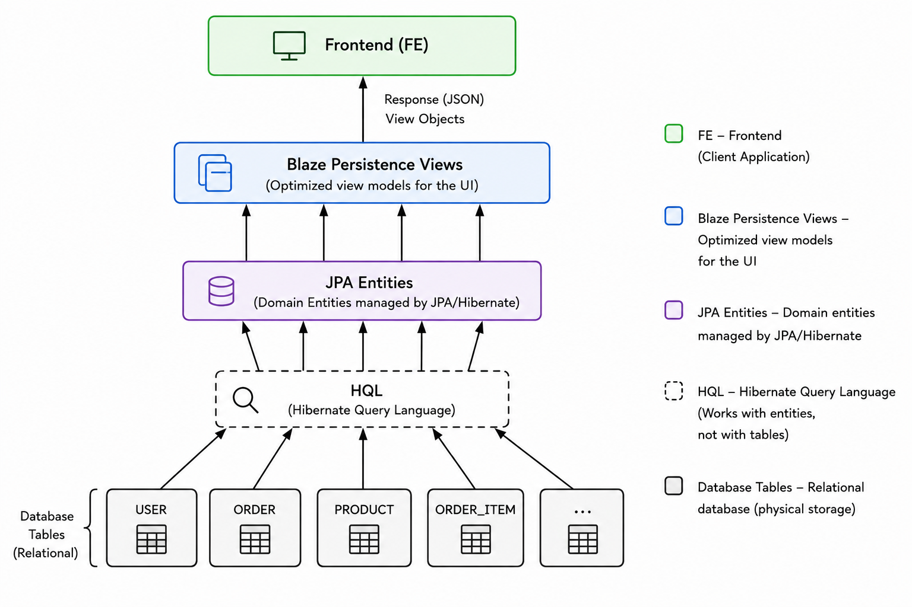

# Exploring Blaze-Persistence Views with Spring Boot 4 and Hibernate 7

Recently I was part of the team creating a bank mobile platform where we built a backend system which in a nutshell
has the following architecture:



There is nothing wrong with this — in fact the system is running fine and very well every day.
However, [Blaze-Persistence](https://persistence.blazebit.com/documentation/1.6/entity-view/manual/en_US/) and its view module offer the following enhancement:



What are the benefits?

1) No MapStruct boilerplate needed.
2) No DTO classes — you define projection interfaces instead, the Views, upon the JPA entities. Blaze Persistence then solves a lot of problems for you:
    - Handles N+1 query problems automatically. Check [TeamView#getMembers()](src/main/java/com/example/blaze_persistence_demo/views/TeamView.java#L16) in this project.
    - No @Transactional hell for reads — views are immutable POJOs, no open session needed.
3) Blaze Persistence is not just about views, it has many integrations: GraphQL, Spring Data (check filter by email in [MemberRepository#findByEmail()](src/main/java/com/example/blaze_persistence_demo/repository/MemberRepository.java#L10)), Quarkus...etc.

Possible cons I see:

1) Longer learning curve. 
2) When trying to filter through child entities I often ended up with Blaze Persistence creating SQL with doubled JOINS :(

## Double JOIN Pitfall

You would think following makes sense.

```java
public List<TeamView> getTeamsByMemberLocation(String location) {
    CriteriaBuilder<Team> cb = criteriaBuilderFactory.create(entityManager, Team.class)
            .leftJoin("members", "m")
            .where("m.location").eq(location);

    return entityViewManager.applySetting(EntityViewSetting.create(TeamView.class), cb).getResultList();
}
```

Anyway this generates this redundant SQL:

```sql
SELECT t.id, t.name, m1.id, m1.first_name, m1.location
FROM team t
LEFT JOIN member m1 ON m1.team_id = t.id          -- generated to fetch TeamView.members
LEFT JOIN member m2 ON m2.team_id = t.id           -- generated again for the WHERE filter
WHERE m2.location = 'Prague'
```

The second JOIN is redundant — BP generates one JOIN to resolve the `TeamView.members` mapping and another for the `where("m.location")` filter, even though they reference the same join alias.

You can call this endpoint to reproduce: `GET /teams/by-member-location?location=Prague`

⚠️ **Pitfall:** Mixing manual joins with view mappings silently generates redundant SQL — BP does not warn you :(

**Fix — use a subquery instead, let BP manage its own join for the view:**

```java
public List<TeamView> getTeamsByMemberLocation(String location) {
    CriteriaBuilder<Team> cb = criteriaBuilderFactory.create(entityManager, Team.class, "t")
            .whereExists()
                .from(Member.class, "m")
                .where("m.team").eqExpression("t")
                .where("m.location").eq(location)
            .end();

    return entityViewManager.applySetting(EntityViewSetting.create(TeamView.class), cb).getResultList();
}
```

## Running the project

Start Postgres in Docker:

```bash
docker run --name postgres -e POSTGRES_PASSWORD=heslo12345 -p 5432:5432 -d postgres
```

Run the app (Liquibase will create schema and insert test data automatically), then test endpoints via curl:

```bash
# Get team with all members
curl "http://localhost:8080/teams/Alpha/members"

# Get members with points above threshold
curl "http://localhost:8080/teams/members/top?minPoints=50"

# Get member by email
curl "http://localhost:8080/teams/members/by-email?email=john@example.com"

# Get teams by member location (Double JOIN pitfall endpoint)
curl "http://localhost:8080/teams/by-member-location?location=Prague"
```

